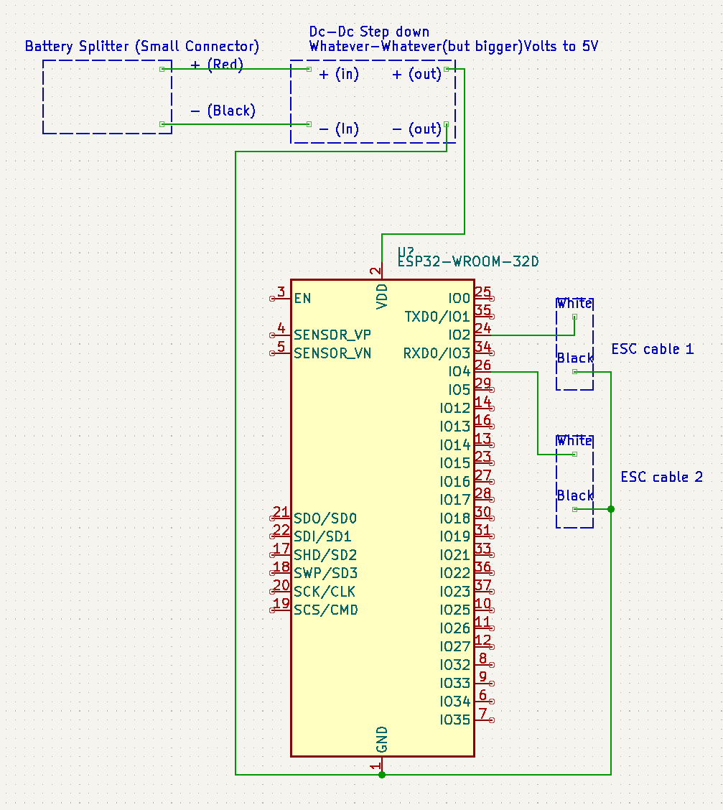
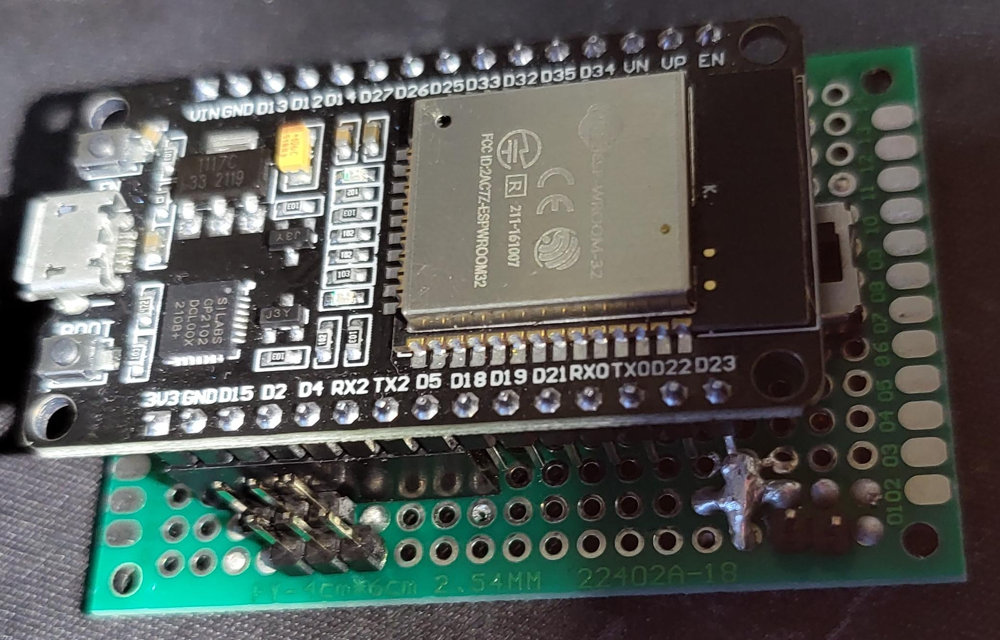
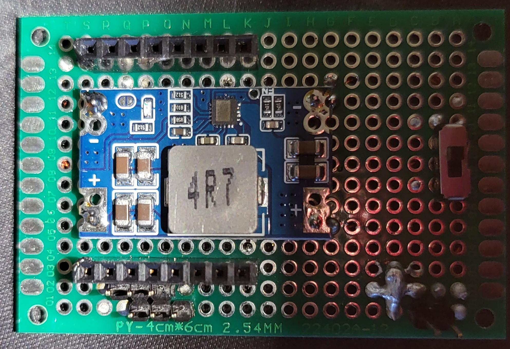
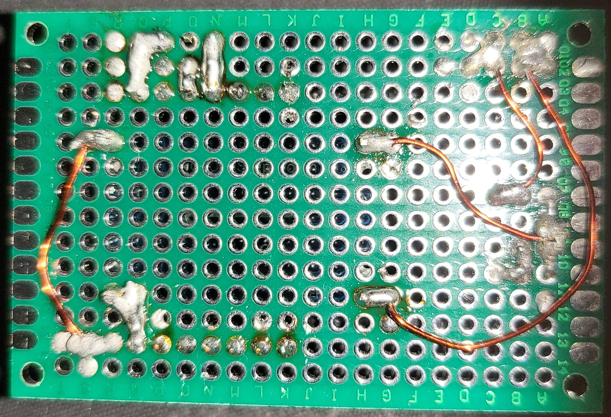

# snowcat-esp32-controller

**Make sure you realize I have no idea what I'm talking about when it comes to electronics, I just do things and they end up working. I see no reason why anything here should be wrong however.**

An esp32 based controller for the RCTF Snowcat

Project based on : https://gitlab.com/ricardoquesada/esp-idf-arduino-bluepad32-template


# How to use
1. Follow the instructions in the [Compile](#building-the-firmware) section.
2. Have everything connected together in a similar fashion to the [Circuit Board](#circuit-board) section.
3. Check section [Controls](#control-types) to know "how" to drive it
4. Power everything on
5. ???
6. Snow

Anything in the build guide still goes (appart from the BEC and the radio stuff), so make sure you follow everything in there.

To connect a controller, just put it in sync mode and it should connect immediately. Some controllers remember the ESP and can reconnect without being put back in sync mode.

## Configuration
You probably don't have to change anything, but here are the four "easy" to tweak values
- `LINEAR_ACCELERATION`: Changes how fast the motors accelerate (for linear acceleration)
- `PARTWAY_ACCELERATION`: Changes how much of the PWM change left to go is applied (for partway acceleration)
- `DEADZONE`: Changes the stick's deadzone
- `LEFTESC_WHITE_PIN`: The pin in which the white cable is plugged in. Change this if you plugged it in somewhere else, or if you find recompiling the firmware simpler than swapping the two ESC cables.
- `RIGHTESC_WHITE_PIN`: The pin in which the other white cable is plugged in. Change this if you plugged it in somewhere else, or if you find recompiling the firmware simpler than swapping the two ESC cables
- `THROTTLE_MS_DELAY`: This is the delay between when the speed changes, currently set at `10ms`
- `ESC_CENTER_OFFSET`: This is to take into account the "true" deadzone of the ESCs
  - It changes the PWM by that value whenever the pwm is equal to `ESC_CENTER_POINT` (1500)
  - Default is `-10`, ("center" pwm is thus 1490)
  - You could set it at 0 if your ESCs don't randomly pulse when at 1500

## Control Types


Common controls:
- `select/share/screenshot/minus/'menu back'`: Changes the Control Type
- Acceleration
  - I'm not sure of what safe increments we can use so I'm looking for input on that
  - Currently goes "halfway" every 10ms
- Deadzones
  - A default deadzone of around 10% of the stick's travel is in place
  - It can be lowered, but it's in place because one of my controllers is awful and kept jerking the motors back and forth.
  - Change the `DEADZONE` value in `arduino_main.cpp`
- ESC Ranges
  - In my case, my escs do nothing between ~1464PWM and 1500 PWM. The middle point is still set to 1500, but you might see some jerk forward once you stop going backwards, and the backwards controls might be "slow" to respond if you are in a similar situation
  - To adjust for that jerking, whenever 1500 pwm is seen, 1490 is actual sent to the ESC. This can be adjusted with `ESC_CENTER_OFFSET` 
- Calibration
  - Pressing A and B (or Circle and Cross) as the same times enables "calibration" mode 
    - The controller blinks to let you know
    - Spin the sticks round and round a couple of times
    - This sets the maximum values for the less well made controllers to give you "full" range
    - Should you set "poor" values that would make you go over 100% speed when at full stick tilt, the speed will not keep increasing 
  - Press X and Y (or Square and Triangle) at the same time to save and exit.
    - The controller blinks to let you know
  - Currenlty no calibration for the analog triggers
  - Calibration is currently lost on power loss, but is transfered to "new" controllers.

### **"Tank-style"** (Player 1/red)
This is the default mode where the left side of the controller controls the left track, and the right side, the right track. 
- L2/R2 go forward (Analog controllers have variable speed)
- L1/R1 go backward
- Left Stick/Right stick both control one side
  - Only up/down movement is registered. left/right does nothing

TODO: Have a way to "reduce" the throttle of the analog triggers by tilting the sticks in the opposite direction
### **Racecar** (Player 2/green)
"Racecar" controls are coming soon TM
- R2: Forward
- L2: Backwards
- Right stick
  - Left goes left
  - Right goes right

### **Single Stick** (Player 3/blue)
"SingleStick" controls are coming soon TM
- Right Stick
  - Left goes left
  - Right goes right
  - Up goes forward
  - Down goes backward


# Circuit Board

Here is a rough, poorly made, sketch of the circuit.



Here's a couple things to note. 
- Since electricity is magic and mixing voltages is weird, I would avoid plugging the ESC's grounds in the "same" ground as the 5V ground
  - I use the ground besides the 3.3v pin to ground both of the ESC's black wires
  - It should be fine, but eh, if you insist on doing it, use a diode coming out of the esc's ground.
- You can power the ESP board using a DC-DC 3.3v converter, you just have to feed it into the 3.3V pin.
  - As long as you have a converted that's rated for your battery. A lot go up to 30v so if should be fine with anything between 2s and 6s. 
  - If you somehow are running a 2s battery, you should probably opt for a 3.3v converter as some of the 5v converters fail to output under 7volts. A 5V would thus theoretically only work for about half if the "safe" voltage of your 2s battery. It might also just start outputting a lower voltage and your ESP32 may or may not decide that it's fine. I would try to avoid it however.
- I have an inline switch between the positive of the battery and the DC-DC. If you want a switch, make sure to do that, otherwise turning it off wont shut the ESP down because there are grounds everywhere.
- I use pin 2 and 4 (IO2 and IO4) as the PWM generators for the ESCs because they were easy to set up in a way I wouldn't have to use more magnet wire. A perk that comes from using PIN2 is that the blue LED of the ESP32 turns on once the controller is connected and it saves me the 2 lines of code to do it ;P
- You might notice that pin d23 is awfully close to the + blob of the battery, they don't make contact, but I made sure to trim everything down and add Kapton tape
  - This could have been avoided had I opted to use "hotswap" connectors for all the 16pins, I just didn't feel like it.
- Make sure you test everything to make sure there are no shorts
  - One of the dc-dc converters was bad and sent sparks flying when I plugged in the battery. 
- Please disregard my poor soldering job.
- I have no idea how to use kicad, so I know, the circuit is ugly
  

Here are a couple pictures of the board I made for those who like to see stuff: 




# Building the firmware

Requires ESP-IDF **v4.4** or newer (5.0 seems to fail).

Includes the following ESP-IDF components, with a pre-configured `sdkconfig` file:

* [Arduino Core for ESP32](https://github.com/espressif/arduino-esp32) component
* [Bluepad32](https://gitlab.com/ricardoquesada/bluepad32/) component
* [BTStack](https://github.com/bluekitchen/btstack) component

## How to compile it (This section is taken from the Bluepad32 template)

The following are the instructions for **Linux**, and should work for **macOS** as well. For **Windows**, use the
[ESP-IDF online installer][esp-idf-online-installer], and select `release/v4.4` branch.

1. Requirements and permissions

    Install ESP-IDF dependencies (taken from [here][toolchain-deps]):

    ```sh
    # For Ubuntu / Debian
    sudo apt-get install git wget flex bison gperf python3 python3-pip python3-setuptools cmake ninja-build ccache libffi-dev libssl-dev dfu-util libusb-1.0-0
    ```

    And in case you don't have permissions to open `/dev/ttyUSB0`, do:
    (taken from [here][ttyusb0])

    ```sh
    # You MUST logout/login (or in some cases reboot Linux) after running this command
    sudo usermod -a -G dialout $USER
    ```

2. Install and setup ESP-IDF

    ```sh
    # Needs to be done just once
    # Clone the ESP-IDF git repo
    mkdir ~/esp && cd ~/esp
    git clone -b release/v4.4 --recursive https://github.com/espressif/esp-idf.git

    # Then install the toolchain
    cd ~/esp/esp-idf
    ./install.sh
    ```

3. Compile the template

    Clone the template:

    ```sh
    # Do it everytime you want to start a new project
    # Clone the template somewhere
    git clone --recursive https://github.com/chpoit/snowcat-esp32-controller.git snowcat-esp32-controller
    ```

    Export the ESP-IDF environment variables in your shell:

    ```sh
    # Do it everytime you open a new shell
    # Optional: add it in your ~/.bashrc or ~/.profile
    source ~/esp/esp-idf/export.sh
    ```

    And finally compile and install your project.

    ```sh
    # Compile it
    cd <PATH-TO>/snowcat-esp32-controller
    idf.py build

    # Flash + open debug terminal
    idf.py flash
    ```
4. Once the firmware is flashed you should be able to just plug in everything and have everything work.
